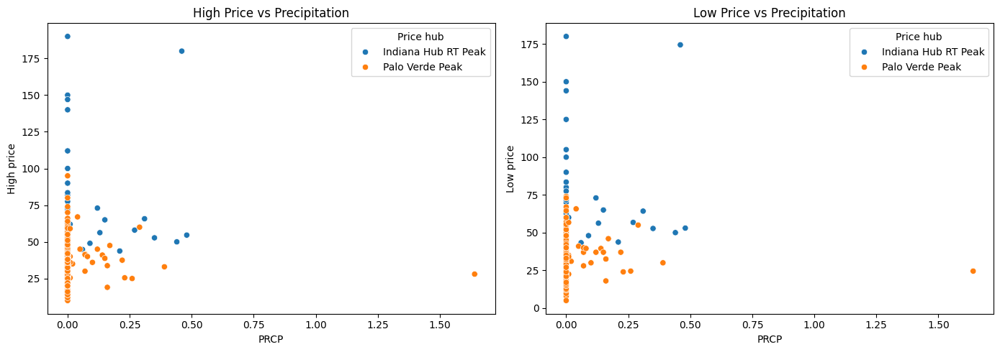
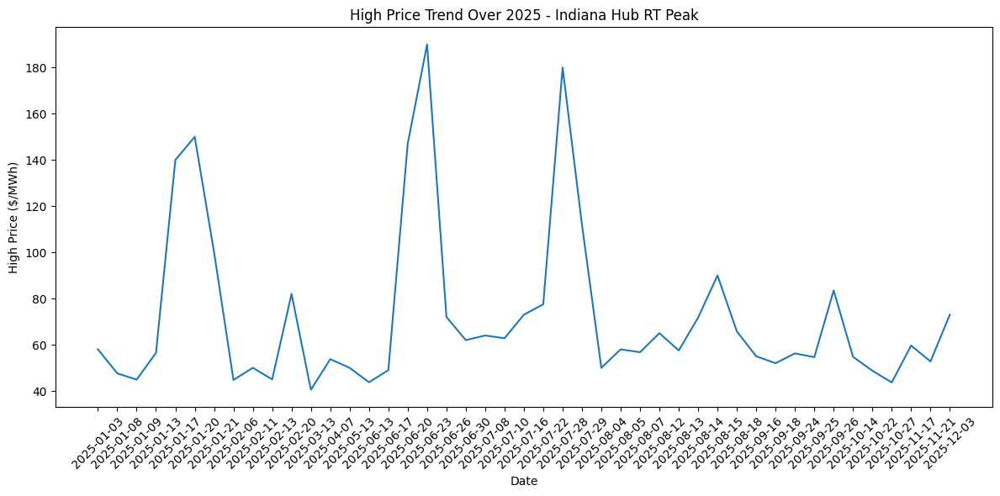

## Introduction

In this analysis, we used weather data in tandem with electricity price data to determine if weather has a significant correlation with electricity prices. Given that certain areas of the United States have large amounts of electricity coming from solar energy, we thought it would be interesting to see if that translates into energy prices varying more with weather compared to areas that rely on weather-independent sources of electricity. 

We limited the scope of the analysis to be for 2025, as this would give us the most relevant findings.

## Methods

### Data gathering/cleaning

We obtained our weather data from the website of the National Oceanic and Atmospheric Administration (noaa.gov), which has historical weather data from most weather stations across the country. This data, despite being very useful, introduced a hurdle in the analysis, since we could not find any historical data sources that included cloud coverage data. However, since precipitation was recorded, we used that as a predictor variable that would be correlated strongly with cloud cover.

We obtained our electricity data from the website of the U.S. Energy Information Administration, which has records of energy price and usage across the United States. One hurdle in our analysis was the lack of daily electricity prices directly to consumers, as the EIA only has monthly summaries of that data. However, the wholesale energy shares market, as recorded in several geographic market hubs across the US, was available on a daily (or somewhat less frequently than daily) basis, which we decided should still be reflective of energy supply/demand. 

We then cleaned the data, removing unnecessary rows and columns, ensuring all columns were of the correct data type, and merging it into one data set using pandas, then exporting it as a .csv file.

### Analysis

In performing the analysis, we made liberal use of the Seaborn and Matplotlib packages to general visuals. We used:
- .corr() on precipitation, high price, and low price to make a correlation matrix
- sns.heatmap() to make a heatmap of these same three variables
- sns.scatterplot to visualize precipitation vs High price and Low price, with additional graphs for the isolated Indiana and Phoenix data. 
- sns.lineplot to visualize price trends over time

### Predictive Model

We used the linear regression fitting tools in scikitlearn to create a simple predictive model to be able to generate a predicted electricity cost, given a precipitation value. To test our model, we created a predicted price column, using the linear regression model to generate new predicted electricity prices. Creating a scatterplot allowed us to see how good (or bad) the model was at predicting electricity prices.

## Results

From the correlation matrix, combined for both Indiana and Arizona, The correlation between precipitation and high and low price is not very high, sitting at close to 0.07 for both. 

The majority of the points sitting at precipitation = 0 is to be expected, as it does not rain most days, whether you live in Indiana or Arizona. However, this does mean that we have a lower quantity of valuable data than expected, since days that it rains are the ones that actually could show a relationship between precipitation and electricity price. Despite the low amount of data points above precipitation = 0, there does appear to be a slightly positive relationship, which would indicate that an increase in precipitation would relate to a higher average electricity price.
However, one problem with this diagnosis is that it seems that Indiana has higher electricity costs regardless of weather, and since Arizona is very dry, this might cause there to appear to be a relationship when there isn't a significant one. 

Splitting this data into separate graphs for Indiana and Arizona, we see that the correlation is very weak, if present at all. 

In looking at the price over time graphs for Arizona and Indiana, we see that summer tends to have higher prices than other times of the year. This could indicate that demand depends on weather/temperature as well, which makes sense, given the large power draw of AC units. Since sunny days are usually also hotter days, this introduces an interesting confounding variable, since hot, sunny summer days should result in more power produced by solar, but also more power consumed!

The graph below is a scatterplot of the electricity prices predicted by the model vs the actual prices

As expected from previous analysis, the scatterplot does not seem to show a 1 to 1 relationship between the two variables. This means that the model is not very good at predicting electricity prices, based solely on precipitation data. 

## Discussion

[What do these results mean? What could future analyses look into/improve upon?]

We think that future analyses could give more insight into the relationship between electricity prices and weather. The hypothesis behind our analysis puts the emphasis on how weather affect electricity generation, but it is no secret that weather (specifically temperature) affects energy consumption as well, especially in the summer, as AC units draw a lot of power. Approaching this analysis with a demand-focused hypothesis could allow for insight into energy consumption trends, which would also be useful for those looking to invest in power generation.